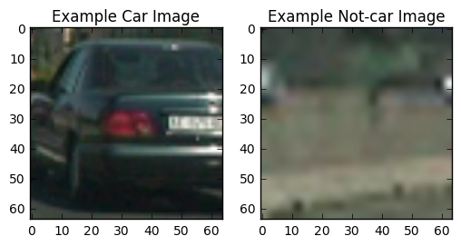
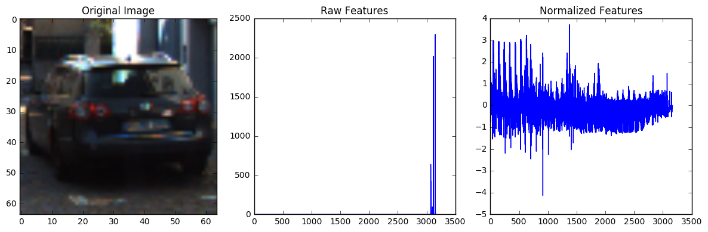
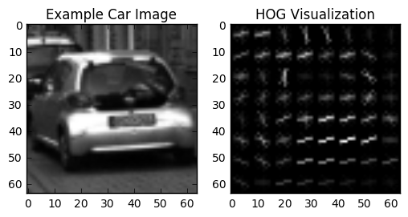
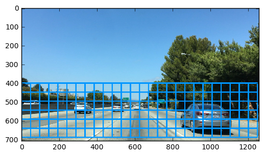
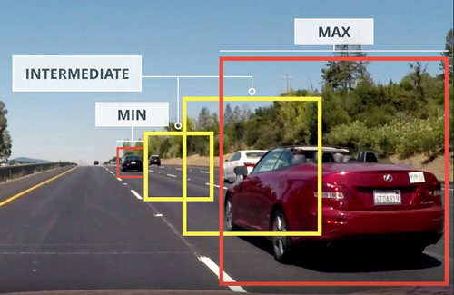
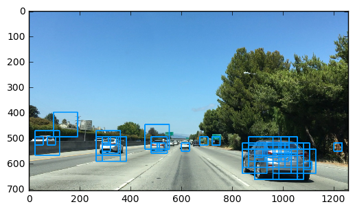
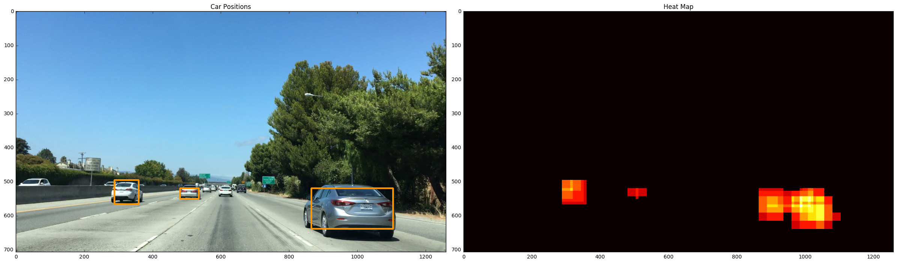
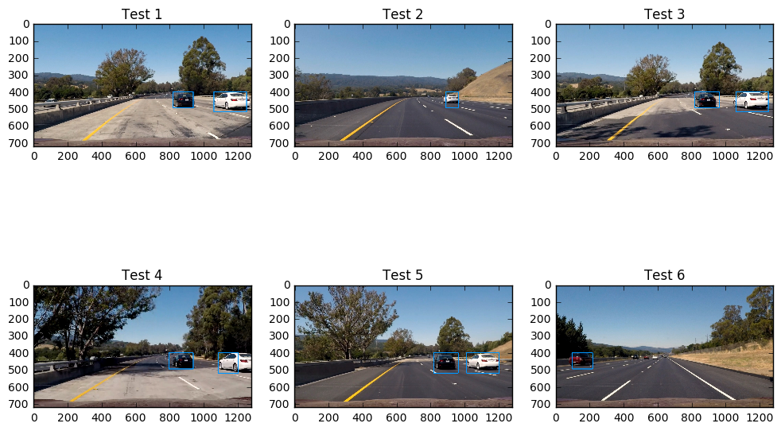
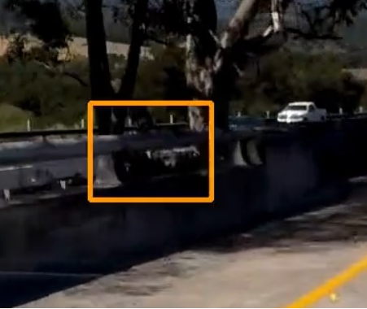

# Vehicle Detection Project

The goals / steps of this project are the following:

- Perform a Histogram of Oriented Gradients (HOG) feature extraction on a labeled training set of images and train a classifier Linear SVM classifier
- Optionally, you can also apply a color transform and append binned color features, as well as histograms of color, to your HOG feature vector.
- Note: for those first two steps don't forget to normalize your features and randomize a selection for training and testing.
- Implement a sliding-window technique and use your trained classifier to search for vehicles in images.
- Run your pipeline on a video stream (start with the test_video.mp4 and later implement on full project_video.mp4) and create a heat map of recurring detections frame by frame to reject outliers and follow detected vehicles.
- Estimate a bounding box for vehicles detected.

Video link

https://www.youtube.com/watch?v=cX3WrvpVXp0&feature=youtu.be

## Data exploration
You can find the code in the **Block 1** in attached IPython notebook

Before starting the project I did a quick data exploration just to touch with my end the images. It was very useful because I discovered that all images are in PNG format so I have to pay attenction how to read them. 
For the rest of the project I'll opening all images with OpenCV library that give me that BGR images with channel color range from 0 ... 255 

Here you can find the stats about dataset:

    Your function returned a count of 8792  cars and 8968  non-cars
    of size:  (64, 64, 3)  and data type: uint8
    
Also all the data are normalized with the range [0 , 1] and the type are converted from uint8 --> float32 
Here an example of the dataset:

## Color, spatial and Hog features extraction
**Explain how (and identify where in your code) you extracted HOG features from the training images. Explain how you settled on your final choice of HOG parameters**

This one is a big point, you can find the code in following blocks:
- **Block 2** Color and spacial bin features
- **Block 3** Hog features
- **Block 4** Features extraction and scaler
- **Block 5** Save result for the future usage

### Color and spacial bin  (Block 2)
The tricky part was to choose the right color space and to scale the images before the computation. The images scaled are very important in order to have a better performance on the classification task (variance 1)

I scaled all images in a range [0...1] and change the histogram range from (0,256) -> (0.0,1.0) 
With the experience from the lessons, exercises and various trials, I decided to map my images with the color space **YCrCb**

For the spacial bin I choose a resolution 32x32 px because it is good to identify a car at low resolution. 
I tried with 16x16 px but seems have a worse performace.

In the end I used the <code>sklearn.StandardScaler()</code> to scale the data in order to normalize the features weight 
Here an example of the results:

### Hog features (Block 3)
The HOG detaction it was a very nice technics that use the magnedute of the gradient to discover the real direction of the gradient it self. 
The parameters chosen are: 
**orient** = 9
**pix_per_cell** = 8
**cell_per_block** = 2
After some trial this parameter are good trade off between performance / number of feauture extracted for the SVM model

I tried also the gamma correction on the hog extraction to avoid false positive in the darker zone on the video but it seems not work well so I decided to remove it and to use some others technics

Here an example of the hog extraction:

### Features extraction and scaler (Block 4)
At the last block you'll find the mesh of the all technics discuss before. Just to recap here all the parameters:

    color_space = 'YCrCb' # Can be RGB, HSV, LUV, HLS, YUV, YCrCb
    orient = 9  # HOG orientations
    pix_per_cell = 8 # HOG pixels per cell
    cell_per_block = 2 # HOG cells per block
    hog_channel = "ALL" # Can be 0, 1, 2, or "ALL"
    spatial_size = (32, 32) # Spatial binning dimensions
    hist_bins = 32    # Number of histogram bins
    hist_range = (0.0, 1.0)  # Range for a normalized img
    spatial_feat = True # Spatial features on or off
    hist_feat = True # Histogram features on or off
    hog_feat = True # HOG features on or off
    gamma_correction = False
    
And here the result on the entire dataset:

    104.1 Seconds to extract features from hog, spatial and color...
    (17760, 8460)
    
In the end I saved the result in a pickle file just to re use it

## Linear SVM Classifier
**Describe how (and identify where in your code) you trained a classifier using your selected HOG features (and color features if you used them)**

You'll find the code in the **Block 6**

I choose the Support Vector machine for two reasons:
 - First one it is the first time that I used it :)
 - Second one for this type of problem, dataset dimension and number of features I guess it was an optimal choice
 
Before run the classifier I did some data preparition:
 - Features extration discussed above (HOG, COLOR, SPATIAL)
 - I scaled all data with the <code>sklearn.StandardScaler()</code> to normalize the weights
 - I create the target variable with 1 for "car" and 0 for "not car"
 - I shuffled the data with <code>sklearn.utils.shuffle</code> to prevent some ordering in the data, in fact we talked about data recorded from a car so a lot of frames should be similar
 - I created the test set with a 20% of data from train set with the <code>sklearn.model_selection.train_test_split</code>
 - Finally I ran my linear SVM classifier with the follow results:
 
        Using: 9 orientations 8 pixels per cell and 2 cells per block
        Feature vector length: 8460
        6.8 Seconds to train SVC...
        Test Accuracy of SVC =  0.9904
        
## Sliding Window Search
**Describe how (and identify where in your code) you implemented a sliding window search. How did you decide what scales to search and how much to overlap windows?**
    
This point is divided into following part:
 - Sliding windows (only graphic)
 - Multiscale sliding windows (with the classifier)
 - Improve performance of the sliding windows (parameters for the pipeline)
 - Heatmap to reduce false positive e multiple detection

### Sliding windows
This was also a tricky part to choose a good parameters for good sliding windows 

First I started with a very simple version of the sliding windows with only graphic component, you can find the implementation in the **Block 7**.
After from the suggestion in the lessons I reduce the region of interest of the sliding windows with follow coordinates:

H = (400,680)
W = (0,1280)

### Multiscale sliding windows
After I bind my classifier to sliding windows with a function named:

    search_windows()
    
You can find the code in the **Block 8** 
I used different scale of sliding windows in order to match tree class of objects:
 - NEAR (96,96)
 - MID  (64,64)
 - FAR  (32,32)

Here you can find a simple schema to resume the technics:

 
Here you can find the result of multi scaled sliding technics:

### Improve performance
Anyway this type of implementation is **inefficient** in fact I have to extract all features (hog, color, spatial). So the best is to extract the features array once and then sub-sampling it in the n-chunk and predict the result on it.

I defined a function named:

    find_cars()

You can find the base code in **Block 9** and in **Block 11** I modify it with new paraments for the pipeline:
 - Sliding windows size - to run the function thoght different size
 - Histogram range size - to pass the correct range for the normalized data

The result of this improvement are fantastic 
Normal version **Block 8**

    8.27 Time to extract features...
    
Improved version:  **Block 9**

    1.04 Time to extract features...  better!
 
### Heatmap
You'll find the code in the **Block 10**

In order to avoid false positive or multiple detection I used a trick lerned during lessons, to add some "heat" to the detected car windows.
With the *temperature* of the windows we can avoid:
 - to draw multiple detection and draw a single box around 
 - false positive detection because we can choose a **thereshold** to decide how many overlapped windows are needed to have a real car detection
 
After various trials I choose a **Threshold** = 2
 
Here a result image:

## Try the pipeline on test images
**Show some examples of test images to demonstrate how your pipeline is working. How did you optimize the performance of your classifier?**

You'll find the code in the **Block 11**

Finally I'll tried my entire pipeline on the tests images inside the folder **test_images** attached in the project
The function name is:

    process_image()

Here the result:

I take some time to optimize the pipeline because I have problem with detection and false positive. Following I'll report the step and thinking:
 - First at all I used in the first part of the project the RGB space for the detection but the YCrCb seems better in fact in the I gain 2 % in the test set accurancy
 - For the false positive first I played around with the threshold of the heat map but the winner strategy is to drop the MID slinding windows, so in the final pipeline I used only the FAR and NEAR windows.
 - For the performance in the first version I had a big problem in fact to convert entire video take around 2 hours (on my laptop) so after developing the sub-sampling my life become more easy, take only 12 minutes
 
## Video implementation
**Provide a link to your final video output. Your pipeline should perform reasonably well on the entire project video (somewhat wobbly or unstable bounding boxes are ok as long as you are identifying the vehicles most of the time with minimal false positives.)**

Here the link to the final video
        
       https://www.youtube.com/watch?v=cX3WrvpVXp0&feature=youtu.be
       
You'll find the code in **Block 12**
       
**Describe how (and identify where in your code) you implemented some kind of filter for false positives and some method for combining overlapping bounding boxes.**

As discussed before to prevent the false positive I used:
- overlapped boxes with *tempature* technics
- drop the intermediate slinding windows 

## Discussion
**Discussion includes some consideration of problems/issues faced, what could be improved about their algorithm/pipeline, and what hypothetical cases would cause their pipeline to fail.**

- We can have false positive when we have guardrail plus three (See image below)
- To improve the pipeline we can add some features like more color space or output of SOBEL operator
- The pipeline may fail in the long darker zone because there aren't gamma consideration
- The pipeline consider only the normal car like Berlina or City car so if we found a big truck the detection maybe not work properly. I'll have to try.
- If we use BIRD'S EYE view in this project we can create a dinamyc region of interst for the detection.
- With some prospective trick we can calculate the distance from the others car

## Thanks for reading
### Diego Paladini
